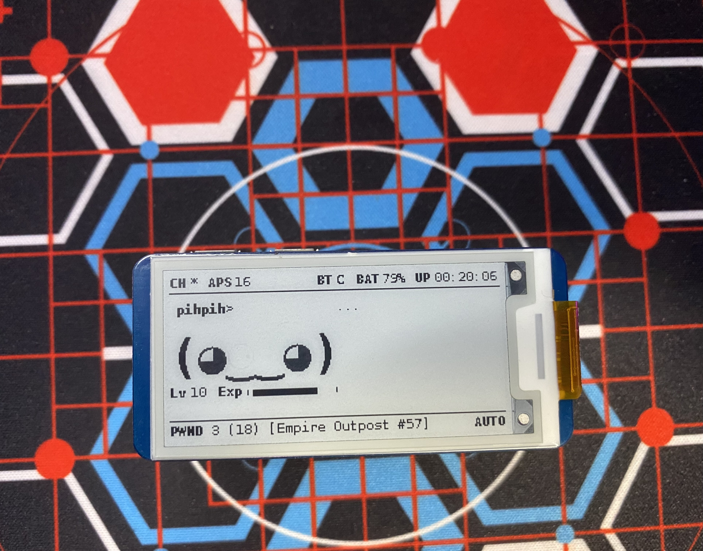

# pwnagotchi-plugins

# Custom Plugin Setup
If you have not set up a directory for custom plugins, create the directory and add its path to your config.toml.
`main.custom_plugins = "/usr/local/share/pwnagotchi/custom-plugins/"`

# UPS HAT (C) Plugin
A plugin that will add a battery capacity and charging indicator for the Waveshare UPS HAT (C)
 

## Requirements
- "i2c" in raspi-config enabled 
- smbus installed `sudo apt-get install -y python-smbus`
## Setup
1. Copy over `ups_hat_c.py` into your custom plugins directory
2. In your `config.toml` file, add the line `main.plugins.ups_hat_c.enabled = true`
3. Restart your device to see your new indicator!

