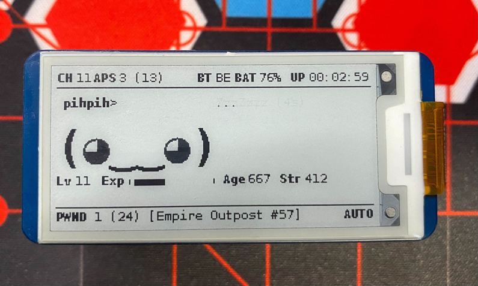

# pwnagotchi-plugins

# Custom Plugin Setup
If you have not set up a directory for custom plugins, create the directory and add its path to your config.toml.
`main.custom_plugins = "/usr/local/share/pwnagotchi/custom-plugins/"`

# Age Plugin
A plugin that adds age and int stats based on the the time training and the number of epochs trained.
Whenever your pwnagotchi has lived through another 100 epochs or epochs trained, a new status will appear!
 

## Setup
1. Copy over `age.py` into your custom plugins directory
2. In your `config.toml` file add:
```toml
main.plugins.age.enabled = true
main.plugins.age.age_x_coord = 0
main.plugins.age.age_y_coord = 32
main.plugins.age.int_x_coord = 67
main.plugins.age.int_y_coord = 32
```
3. Restart your device to see your new stats!

# UPS HAT (C) Plugin
A plugin that will add a battery capacity and charging indicator for the Waveshare UPS HAT (C)
 

## Requirements
- "i2c" in raspi-config enabled 
- smbus installed `sudo apt-get install -y python-smbus`
## Setup
1. Copy over `ups_hat_c.py` into your custom plugins directory
2. In your `config.toml` file, add:
```toml
main.plugins.ups_hat_c.enabled = true
main.plugins.ups_hat_c.label_on = true  # show BAT label or just percentage
main.plugins.ups_hat_c.shutdown = 5  # battery percent at which the device will turn off
main.plugins.ups_hat_c.bat_x_coord = 140
main.plugins.ups_hat_c.bat_y_coord = 0
```
3. Restart your device to see your new indicator!

# Waveshare 3.7 Inch Display 

## Setup
3. Copy `waveshare3in7.py` into `/usr/local/lib/python3.11/dist-packages/pwnagotchi/ui/hw`
4. In the `config.toml` set `ui.display.type = "waveshare3in7"`
5. In `/usr/local/lib/python3.11/dist-packages/pwnagotchi/ui/components.py` in the `class LabeledValue`, replace `def draw` with
```python
    def draw(self, canvas, drawer):
        if self.label is None:
            drawer.text(self.xy, self.value, font=self.label_font, fill=self.color)
        else:
            pos = self.xy
            drawer.text(pos, self.label, font=self.label_font, fill=self.color)
            drawer.text((pos[0] + self.label_spacing + self.label_font.getsize(self.label)[0], pos[1]), self.value, font=self.text_font, fill=self.color)
```
